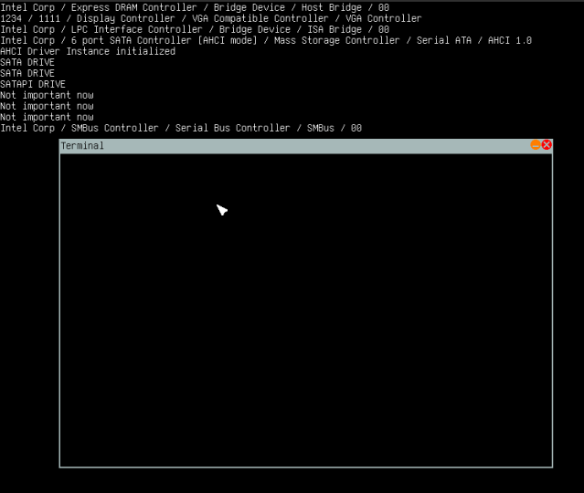

<p align="center">
  
</p>

<div style="text-align:center">


</div>

# Jonix
> Jonix is a simple kernel written in C++. 

## Features
- PS/2 Keyboard and Mouse support
- PCI driver
- ATA Driver
- Malloc and free
- Paging
- Scheduling
- Simple GUI
- VGA Mode

## How to build and run the kernel with qemu
Install requirements:
```shell
$ sudo apt install build-essential qemu-system-i386 qemu-utils
```
Build and run:
```shell
$ git clone https://github.com/Ampferl/jonix.git
$ cd jonix/kernel/bin/gnu-efi

$ make bootloader
$ cd ../../..

$ make kernel
$ make buildimg
$ make run
```

## Screenshot




## Resources
- [Modern Operating Systems](https://www.amazon.de/Modern-Operating-Systems-Andrew-Tanenbaum/dp/1292061421/ref=pd_vtp_1?pd_rd_w=woz7F&pf_rd_p=4e0c7b51-e41d-4568-8470-6e0da61f6c1d&pf_rd_r=5RKT0SZAHSTB74EE6XNE&pd_rd_r=62b20c45-7b68-4640-a583-50b58a4f9404&pd_rd_wg=Ypblr&pd_rd_i=1292061421&psc=1)
- [OS Dev Wiki](https://wiki.osdev.org/Expanded_Main_Page)
- [Lowlevel.eu](http://www.lowlevel.eu/wiki/Hauptseite)
- [Little OS book](https://littleosbook.github.io/)
- [JamesM's kernel development tutorials](http://jamesmolloy.co.uk/tutorial_html/)
- [Operating Systems From 0 to 1](https://tuhdo.github.io/os01/)
- [EFI](http://developer.intel.com/technology/efia)
- [SATA Specification](https://www.intel.com.au/content/dam/www/public/us/en/documents/technical-specifications/serial-ata-ahci-spec-rev1-3-1.pdf#zoom=100)
- [Gnu-EFI](https://github.com/geneC/gnu-efi/tree/master/gnu-efi-3.0)
- [OVMF](https://github.com/tianocore/tianocore.github.io/wiki/OVMF)
  
## About
- Author: [Jonas Ampferl](https://github.com/Ampferl)
- Website: [jonas.ampferl.com](https://jonas.ampferl.com/)
- Email: [contact@chaepy.net](mailto:contact@chaepy.net)
